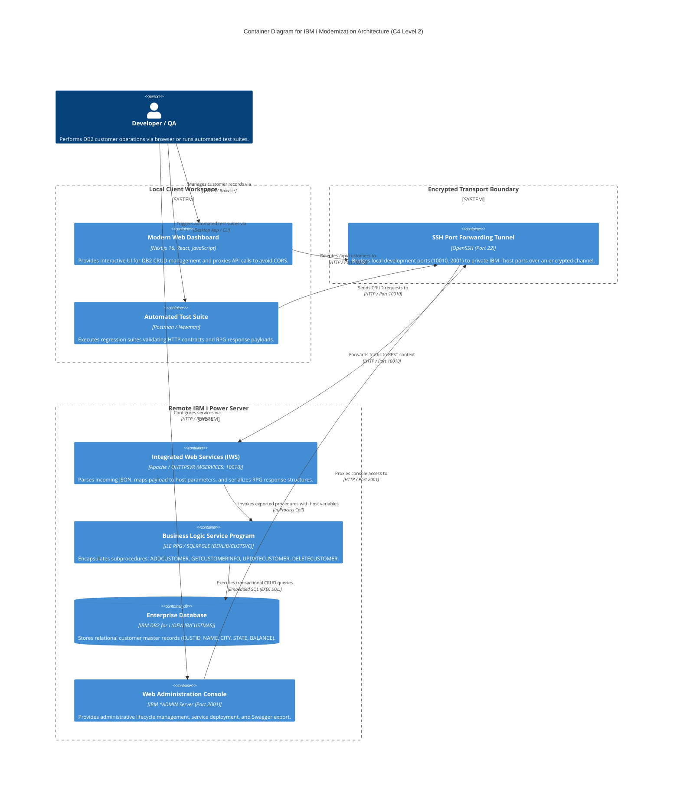

# IBM i RPGLE Modernization: RESTful Microservices & Next.js Dashboard


An end-to-end legacy modernization project demonstrating how to transform traditional IBM i (AS/400) DB2 applications into decoupled, modern cloud-native architectures. 

This repository exposes an RPGLE service program (`CUSTSVC`) over HTTP using **IBM Integrated Web Services (IWS)**, validates full CRUD operations via an automated **Postman regression suite**, and provides a responsive management dashboard built with **Next.js (App Router)**.

---

## Architecture


---

## Tech Stack & Components

* **Backend Engine:** IBM i OS (ILE RPG, Embedded SQL / SQLRPGLE)
* **API Middleware:** IBM Integrated Web Services (IWS) REST Engine
* **Database:** IBM DB2 for i (`DEVLIB/CUSTMAS`)
* **Transport / Security:** SSH Local Port Forwarding (Ports 10010, 2001, 2002)
* **API Validation:** Postman Collection Runner / Newman CLI
* **Frontend:** Next.js (App Router, JavaScript), Next.js Server Rewrites

---

## 1. Database & RPG Business Logic

The database layer runs on DB2 physical file `DEVLIB/CUSTMAS`:

| Column Name | Internal Type | SQL Type | Length / Scale | Nullable | Description |
| :--- | :--- | :--- | :--- | :--- | :--- |
| `CUSTID` | `ZONED` / `PACKED` | `DECIMAL(7, 0)` | 7, 0 | No (PK) | Customer Identifier |
| `NAME` | `CHAR` | `VARCHAR` / `CHAR(50)` | 50 | Yes | Customer / Company Name |
| `CITY` | `CHAR` | `CHAR(30)` | 30 | Yes | City |
| `STATE` | `CHAR` | `CHAR(2)` | 2 | Yes | State Code |
| `BALANCE` | `PACKED` | `DECIMAL(9, 2)` | 9, 2 (5 Bytes) | Yes | Current Account Balance |

Business operations are encapsulated inside service program `DEVLIB/CUSTSVC`:
* **`cust_create`**: Executes SQL `INSERT INTO CUSTMAS`. Handles duplicate key conflicts gracefully.
* **`cust_get`**: Executes SQL `SELECT` to fetch customer details by ID.
* **`cust_update`**: Updates record fields for an existing customer ID.
* **`cust_delete`**: Removes the record from `CUSTMAS`.

All subprocedures serialize a standard response payload returning `SUCCESS` (`1` or `0`), diagnostic messages, and record state.

---

## 2. Integrated Web Services (IWS) REST Specifications

The service program `/QSYS.LIB/DEVLIB.LIB/CUSTSVC.SRVPGM` is exposed via the native IBM i IWS runtime on instance `WSERVICES`.

### Service Runtime Profile
* **Resource Name:** `CustomerService`
* **Base Resource URL:** `http://127.0.0.1:10010/web/services/CustomerService`
* **URI Path Template:** `/customers`
* **Execution User ID:** `VIPUL13051`
* **Library List:** `DEVLIB` prepended to user portion
* **Startup Type:** Automatic
* **Service Install Path:** `/www/WSERVICES/webservices/services/CustomerService`
* **Swagger/OpenAPI Spec:** `/www/WSERVICES/webservices/services/CustomerService/META-INF/swagger.json`

---

### Procedure & Method Parameter Mappings

| HTTP Method | Full URI Path | RPGLE Procedure | In/Out Wrappers | Input Parameter Mapping | Media Types |
| :--- | :--- | :--- | :--- | :--- | :--- |
| **POST** | `/customers` | `ADDCUSTOMER` | **In:** `ADDCUSTOMERInput`<br>**Out:** `ADDCUSTOMERResult` | `INPUTDATA` (`struct` from JSON payload) | **In:** `*JSON`<br>**Out:** `*JSON` |
| **GET** | `/customers/{id}` | `GETCUSTOMERINFO` | **In:** `GETCUSTOMERINFOInput`<br>**Out:** `GETCUSTOMERINFOResult` | `PCUSTID` (`int` from `*PATH_PARAM` `id`) | **In:** `*ALL`<br>**Out:** `*JSON` |
| **PUT** | `/customers/{id}` | `UPDATECUSTOMER` | **In:** `UPDATECUSTOMERInput`<br>**Out:** `UPDATECUSTOMERResult` | `PCUSTID` (`int` from `*PATH_PARAM` `id`)<br>`INPUTDATA` (`struct` from JSON payload) | **In:** `*JSON`<br>**Out:** `*JSON` |
| **DELETE** | `/customers/{id}` | `DELETECUSTOMER` | **In:** `DELETECUSTOMERInput`<br>**Out:** `DELETECUSTOMERResult` | `PCUSTID` (`int` from `*PATH_PARAM` `id`) | **In:** `*ALL`<br>**Out:** `*JSON` |

---

### Connection Pool & Environment Settings
* **Host Server:** `localhost` (in-process job execution)
* **Connection CCSID:** `*USERID` (EBCDIC/ASCII mapping managed automatically by IWS)
* **Max Connections / Usage:** `*NOMAX`
* **Inactivity Timeout:** 3600 seconds (1 hour)
* **Max Lifetime:** 86400 seconds (24 hours)
* **Cleanup Interval:** 300 seconds (Maintenance threads enabled)
* **Passed Transport Metadata:** `REQUEST_METHOD`, `REQUEST_URI`, `REQUEST_URL`, `REMOTE_ADDR`, `REMOTE_USER`, `QUERY_STRING`, `SERVER_NAME`, `SERVER_PORT`

---

## 3. Automated API Regression Suite

An automated Postman collection verifies the complete lifecycle sequentially:

1. **`POST /customers`** → Asserts HTTP 200 and `RESPONSE.SUCCESS === "1"`.
2. **`GET /customers/{{custId}}`** → Verifies created record data in DB2.
3. **`PUT /customers/{{custId}}`** → Modifies customer details and asserts successful update.
4. **`DELETE /customers/{{custId}}`** → Removes the customer record.
5. **`GET /customers/{{custId}}`** → Verifies record no longer exists (`RESPONSE.SUCCESS === "0"`).

The suite can also run headlessly via Newman:

```bash
npx newman run tests/CustomerService_tests.json
```

---

## 4. Frontend Web Dashboard (Next.js)

To prevent browser Cross-Origin Resource Sharing (CORS) blocks without modifying IBM i Apache configurations, Next.js rewrites proxy API traffic:

```javascript
// next.config.mjs
const nextConfig = {
  reactStrictMode: true,
  async rewrites() {
    return [
      {
        source: '/api/customers/:path*',
        destination: 'http://127.0.0.1:10010/web/services/CustomerService/customers/:path*',
      },
      {
        source: '/api/customers',
        destination: 'http://127.0.0.1:10010/web/services/CustomerService/customers',
      },
    ];
  },
};

export default nextConfig;
```

---

## Quickstart Guide

### 1. Establish Secure Tunnel
Forward the remote IBM i IWS and Administration ports to your local interface:

```bash
ssh -L 10010:127.0.0.1:10010 -L 2001:127.0.0.1:2001 -L 2002:127.0.0.1:2002 <user>@<ibmi-host>
```

### 2. Run the Frontend App
```bash
cd ibmi-customer-ui
npm install
npm run dev
```

Open [http://localhost:3000](http://localhost:3000) to interact with your live DB2 customer data.
